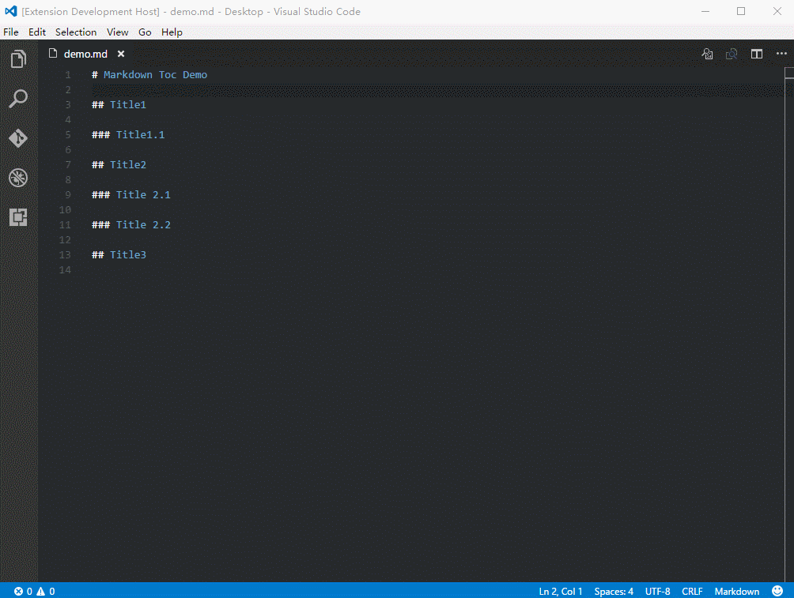

# Find & Share

Find interesting things and share them

-----------------------------------------------------------------------

## VScode Extension - Markdown TOC

>Generate TOC (table of contents) of headlines from parsed markdown file

## Markdown - docsify

>A magical documentation site generator.

**docsify :** [Official website](https://docsify.js.org/#/?id=docsify)

### What it is

docsify generates your documentation website on the fly. Unlike GitBook, it does not generate static html files. Instead, it smartly loads and parses your Markdown files and displays them as a website. To start using it, all you need to do is create an index.html and [deploy it on GitHub Pages](https://docsify.js.org/#/deploy).

### Features

- No statically built html files
- Simple and lightweight (~21kB gzipped)
- Smart full-text search plugin
- Multiple themes
- Useful plugin API
- Compatible with IE11
- Support SSR ([example](https://github.com/docsifyjs/docsify-ssr-demo))
- Support embedded files

### Quick start

It is recommended to install docsify-cli globally, which helps initializing and previewing the website locally.

> npm i docsify-cli -g

### Initialize

If you want to write the documentation in the ./docs subdirectory, you can use the init command.

>docsify init ./docs

### Writing content

After the init is complete, you can see the file list in the ./docs subdirectory.

- index.html as the entry file
- README.md as the home page
- nojekyll prevents GitHub Pages from ignoring files that begin with an underscore

You can easily update the documentation in ./docs/README.md, of course you can add [more pages](https://docsify.js.org/#/more-pages).

### Preview your site

Run the local server with **docsify serve**. You can preview your site in your browser on **<http://localhost:3000**> .

docsify serve docs
For more use cases of docsify-cli, head over to the docsify-cli documentation.